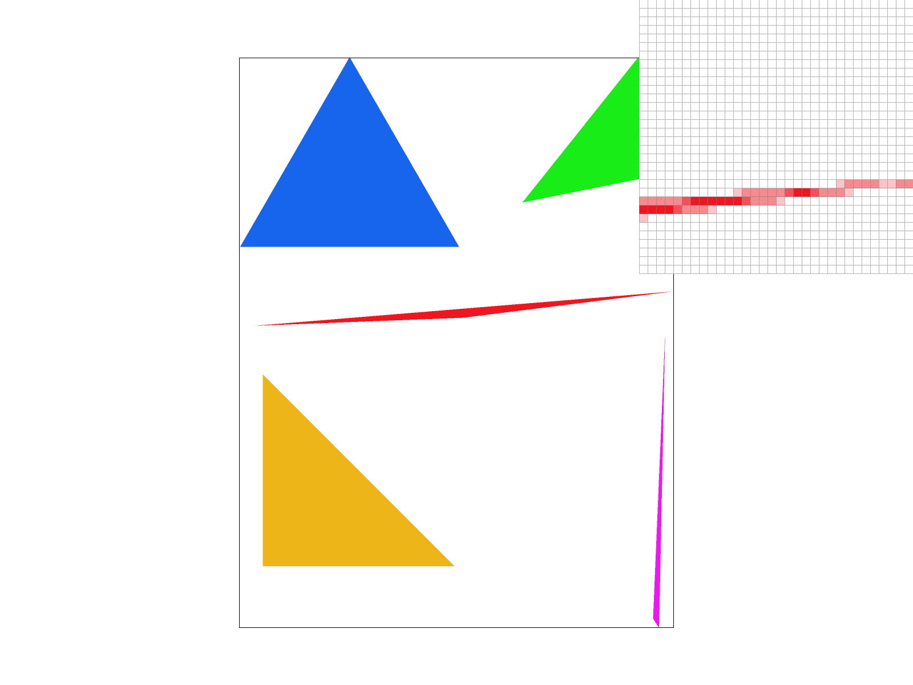
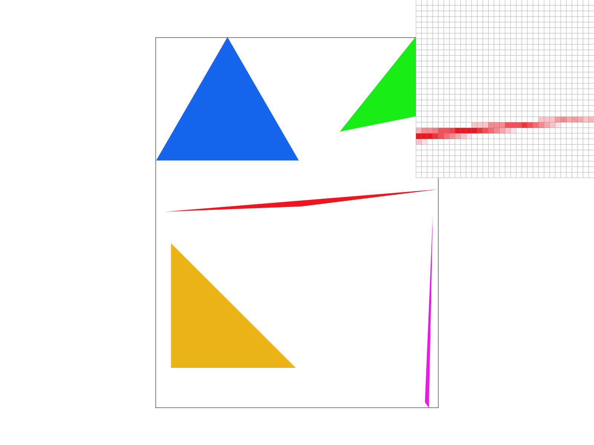
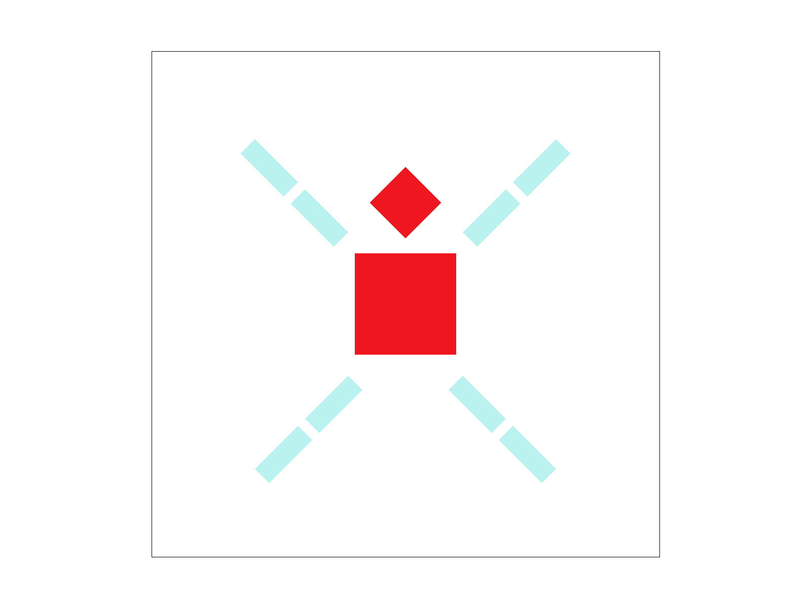
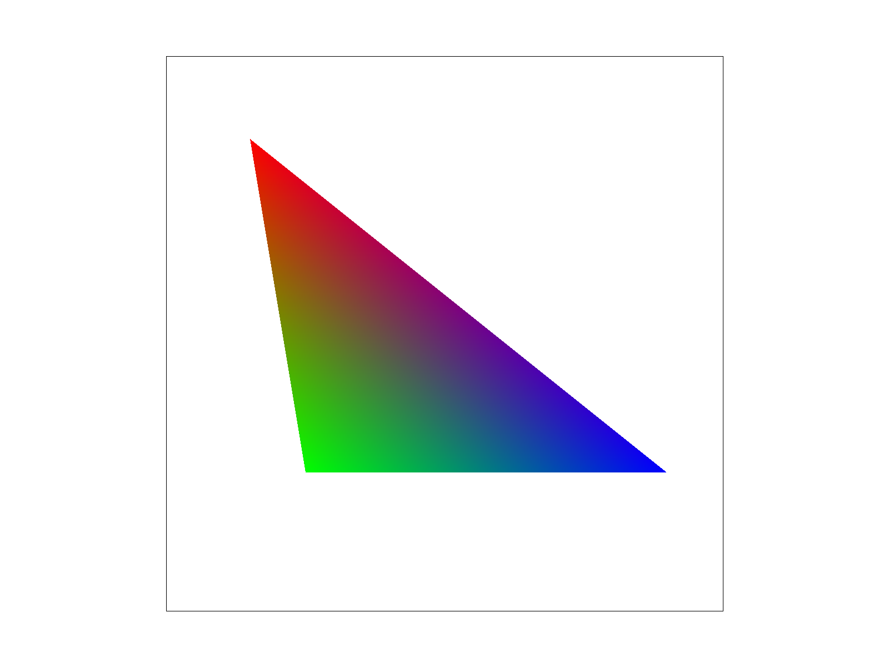
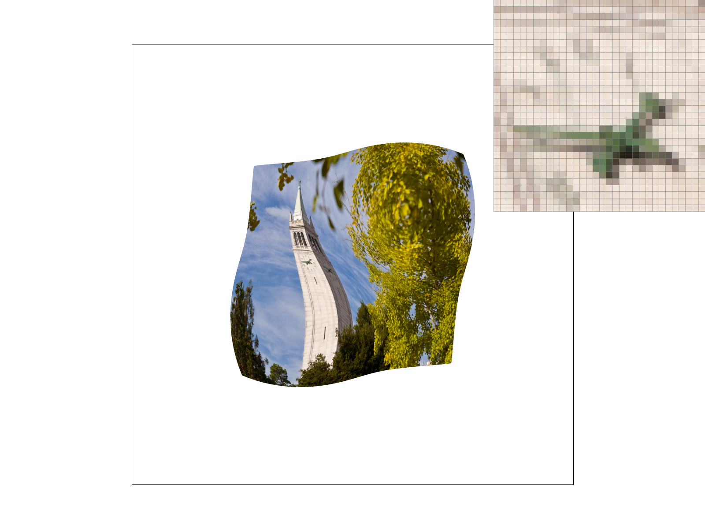

# Homework 1: Rasterizer  
**CS 184/284A – Spring 2025**

**Name:** C.K. Wolfe, Edward Lee

Link to Webpage: [https://cal-cs184-student.github.io/hw-webpages-frame-drop-fam-1/hw1/index.html](https://cal-cs184-student.github.io/hw-webpages-frame-drop-fam-1/hw1/index.html)
Link to GitHub Repository: [https://github.com/redspry/sp25-hw1-X](https://github.com/redspry/sp25-hw1-X) (due to GitHub classroom group issues and being unable to switch groups, we had to create an external fork of the GitHub classroom repository)

## Task 1: Drawing Single-Color Triangles

For each triangle, we calculate the bounding box by taking the minimum and maximum x and y coordinates of the triangle’s vertices. This ensures only the relevant portion of the screen is tested. For each pixel within that bounding box, we sample at (x + 0.5, y + 0.5) to determine if the center of the pixel lies within the triangle. We use a barycentric coordinate (or half-space) test to check if the sample is inside. If it is, we fill the pixel with the triangle’s color using `fill_pixel()`. Because we only iterate over the bounding box of each triangle, this method is no more expensive than sampling every pixel in the bounding box. In other words, we do not check pixels outside the bounding box, which keeps the algorithm efficient.

Below is a PNG screenshot of **basic/test4.svg** with default parameters.

Here is a screenshot with the pixel inspector zoomed in on the blue triangle.

## Task 2: Antialiasing by Supersampling

We use a high-resolution buffer to accumulate subpixel color data. When the sample rate is \( n^2 \), each pixel is subdivided into an \( n \times n \) grid of subpixels. In `rasterize_triangle()`, instead of one center sample per pixel, we now compute subpixel coordinates and test each subpixel for coverage. After rasterization, we average the subpixels in each pixel block to produce the final color in the framebuffer. Supersampling tackles aliasing by capturing partial coverage along edges. Rather than a hard on/off at each pixel center, multiple subpixel samples create smoother transitions by averaging the subpixel colors.

To add supersampling, we added a new array (`sample_buffer`) sized `(width * height * sample_rate)`, updated `fill_pixel()` to write into the supersample array rather than directly into the framebuffer, and added a **resolve step** (`resolve_to_framebuffer()`) that downsamples each \( n \times n \) block to one final pixel color.

Below are **basic/test4.svg** screenshots at sample rates 1 (no supersampling), 4, and 16. Notice how the edges become smoother at higher sampling rates due to the subpixel averaging.

- 1 sample per pixel (1 spp):

- 4 samples per pixel (4 spp):

- 16 samples per pixel (16 spp):

## Task 3: Transforms

In `transforms.cpp`, we completed `translate`, `scale`, and `rotate` by producing 3×3 transformation matrices according to the SVG specification. In the screenshot, you can see the cubeman making snow angels.

## Task 4: Barycentric Coordinates

Barycentric coordinates \((\alpha, \beta, \gamma)\) allow a point \(P\) inside a triangle with vertices \(V_1, V_2, V_3\) to be represented as 
\[
   P = \alpha V_1 + \beta V_2 + \gamma V_3,
\]
where \(\alpha + \beta + \gamma = 1\). This can be interpreted as expressing every point in the triangle as a weighted average of its vertices. Points outside of the triangle will have one of \((\alpha, \beta, \gamma)\) as a negative number. This also enables per-vertex attributes (e.g., color) to be interpolated smoothly across the triangle’s interior, with points closer to the vertices having a similar color to their respective vertex. We updated `rasterize_interpolated_color_triangle(...)` to compute barycentric coordinates per sample and blend vertex colors accordingly. This produces gradients across triangles rather than a single solid color. This can be seen in the following image, where the vertices of this triangle are red, green, and blue and each pixel is colored as a weighted average of how close it is to each vertex.

A PNG of **svg/basic/test7.svg** showing a smoothly blended color wheel at sample rate 1:

## Task 5: “Pixel Sampling” for Texture Mapping (15 pts)

Nearest sampling picks the texel closest to the sample coordinate. It’s faster but can appear blocky when magnified. Bilinear sampling interpolates among four neighboring texels, producing smoother transitions, especially noticeable when the texture is enlarged. `sample_nearest(...)` and `sample_bilinear(...)` in `texture.cpp` handle wrapping, clamping, and coordinate calculation. `sample_nearest(...)` simply gets the closest texel, while `sample_bilinear(...)` gets the four nearest texels and bilinearly interpolates. Shown below are four screenshots demonstrating how nearest vs. bilinear sampling differ at 1 spp and 16 spp:

- Nearest @ 1 spp

- Nearest @ 16 spp

- Bilinear @ 1 spp

- Bilinear @ 16 spp

Observing the images at higher sample rates reveals how bilinear sampling better suppresses aliasing on texture edges. At 1 sample per pixel, the difference is a lot more apparent, as we are sampling less per pixel rather than over 16 samples per pixel to create a better averaging/smoothing effect. At both 1 sample per pixel and 16 samples per pixel, bilinear sampling results in a smoother image than nearest sampling.

## Task 6: “Level Sampling” with Mipmaps (25 pts)

Level sampling is picking the right amount of detail for varying parts of an image by using precomputed "mipmaps" of different resolutions. By analyzing the derivatives of texture coordinates in the screen space, we choose the corresponding mipmap level to utilize the right amount of detail in different parts of the image. This helps avoid minification aliasing, or when a texture is viewed far away or rendered very small.

`get_level(...)` determines which mipmap level to use by analyzing the derivatives of texture coordinates in screen space based on the sampling method. `L_ZERO` always samples the base (highest resolution) level. `L_NEAREST` chooses the nearest mipmap level based on screen-space derivative magnitude. `L_LINEAR` blends between two adjacent levels for a smoother transition, which becomes trilinear filtering if combined with bilinear pixel sampling.

By sampling less per pixel, pixel sampling is best in speed and memory, but is weakest against aliasing.

Level sampling is slower and requires more memory when generating and searching the different mipmap levels, but is stronger against aliasing, as it dynamically changes the level based on the derivative of the texture coordinates in screen space.

Sampling more per pixel is the slowest and most memory-intensive, but is the strongest against aliasing, as it uses the average of the samples within each pixel to determine the final pixel color.

Below are sample comparisons of **L_ZERO** vs. **L_NEAREST** combined with **P_NEAREST** vs. **P_LINEAR**. I chose the Mona Lisa as my image.

- `L_ZERO` + `P_NEAREST`:

- `L_ZERO` + `P_LINEAR`:

- `L_NEAREST` + `P_NEAREST`:

- `L_NEAREST` + `P_LINEAR`:

## Generative-AI Tools
Cursor assisted in writing both the code and the writeup, but both have been extensively created and refined by human input. It did not produce great results, so we went over the results in fine detail for debugging and understand the code we have written.